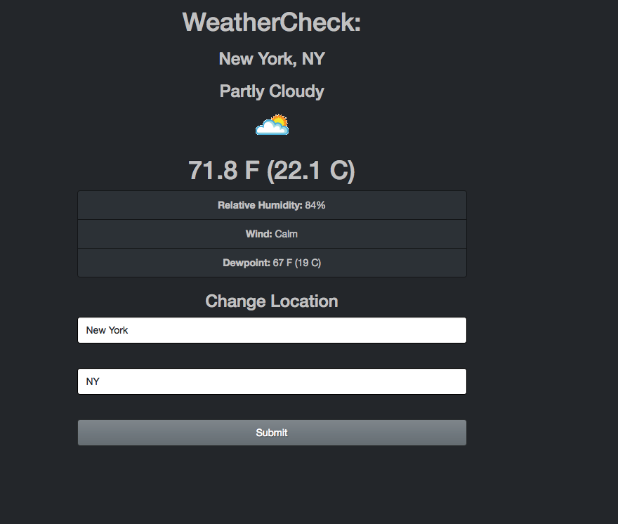

# Check the weather

* I build this app using React and Redux
* The weather information is coming from an API
* I used bootswatch for styling the app

* User can see the weather information from a city of his choice
* Weather information is displayed on the UI

